# ArkDSL

ArkDSL 是针对鸿蒙生态体系，构建的用户友好的鸿蒙应用 GUI 元模型与图形建模语言，以支持从 GUI 模型到高成熟度的前端代码的自动生成，帮助华为开发自主可控的低代码 GUI 生成技术与平台，进一步推进鸿蒙生态系统的发展。ArkDSL 的元模型从项目结构、页面结构和逻辑结构三个部分描述一个 GUI 项目，其表达能力覆盖了鸿蒙 GUI 应用的基础信息，包括元素、布局、动画、逻辑、状态等信息。借助 ArkDSL 构建的鸿蒙应用模型可以通过 [AutoArk](https://github.com/RM2PT/AutoArk) 自动转换为鸿蒙应用的 ArkUI 代码，从而帮助新接触鸿蒙应用开发环境的用户在并不了解鸿蒙应用的架构和开发方式的情况下，能够借助已有的 GUI 开发经验，快速上手鸿蒙 GUI 的设计与开发，在降低学习门槛的同时提高鸿蒙应用的开发效率。

#### 项目结构视图

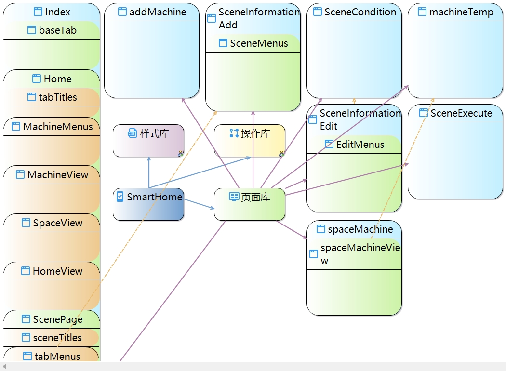

#### 页面结构视图

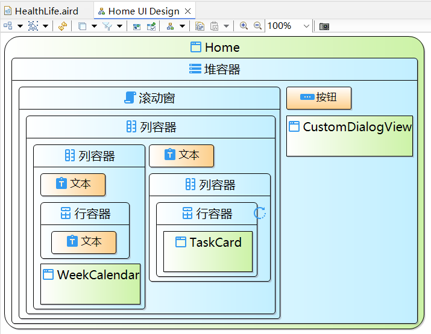

#### 逻辑结构视图

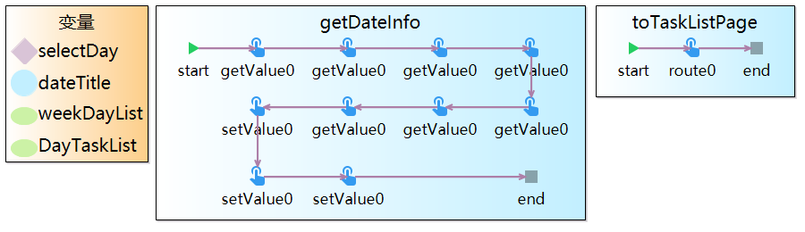

## 插件安装

ArkDSL 目前以 Eclipse 插件的形式安装，依赖于 Eclipse 2022-12。用户可以按照以下步骤安装 ArkDSL 插件包。

1. 选择 Eclipse 顶部工具栏的 `Help > Install New Software...` 选项；

2. 在弹出的窗口中选择 `Add...`，再选择 `Archive...` 选项，接着选中本地的 ArkDSL 插件包；

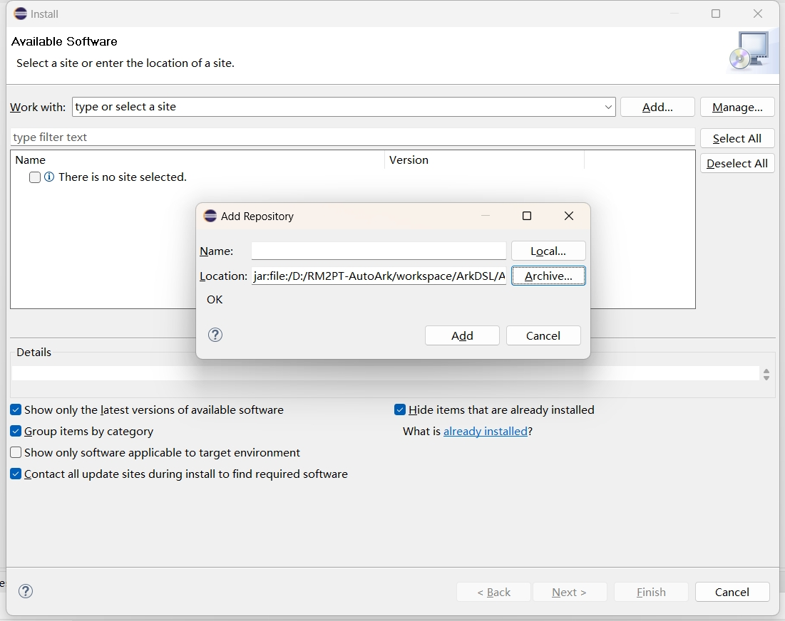

3. 勾选 `ArkUIModelFeature`，取消勾选 `Contact all update sites during install to find required software`，随后 `Next >`；

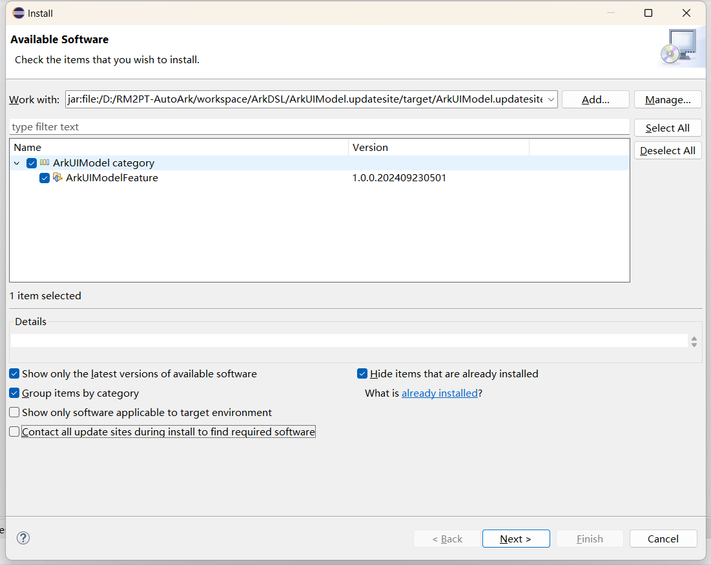

4. 在下一个窗口选择 `Next >`；

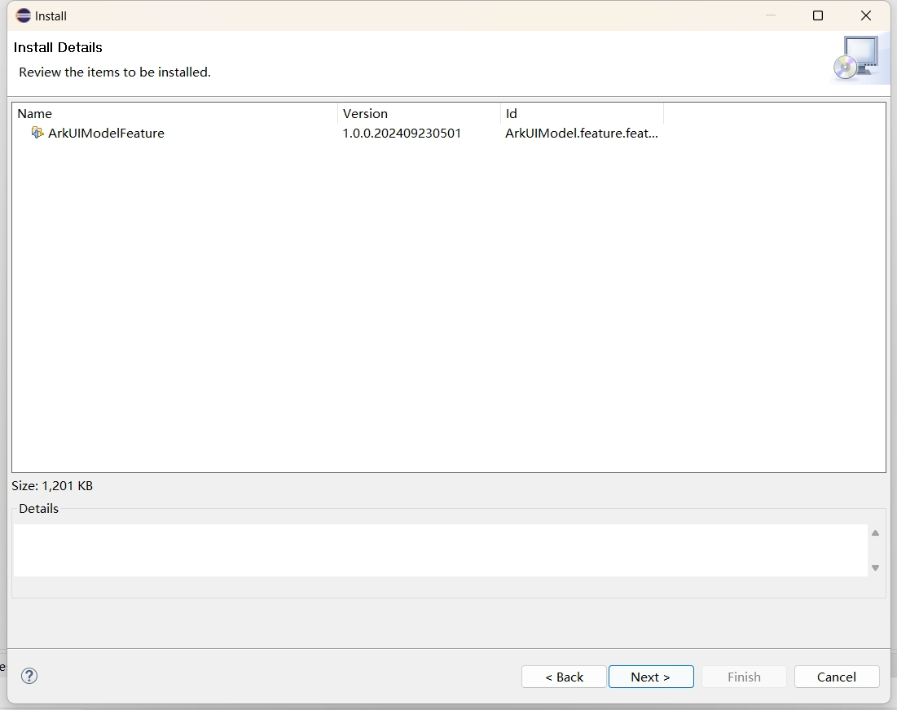

5. 随后接受许可协议条款，选择 `Finish`；

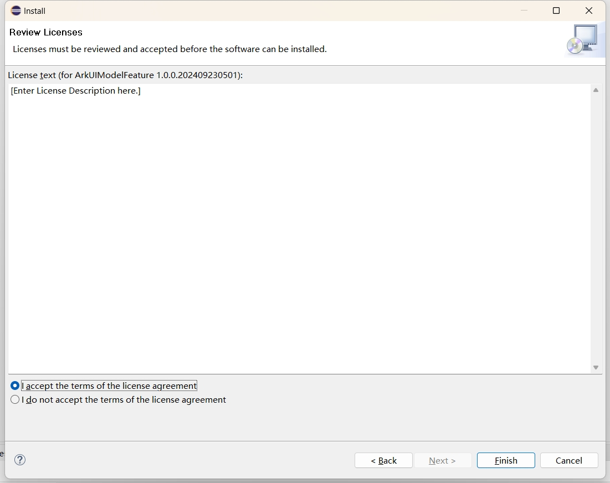

6. 在新弹出的窗口选择 `Select All`，接着 `Trust Selected`，随后重启 Eclipse 以完成 ArkDSL 插件安装。

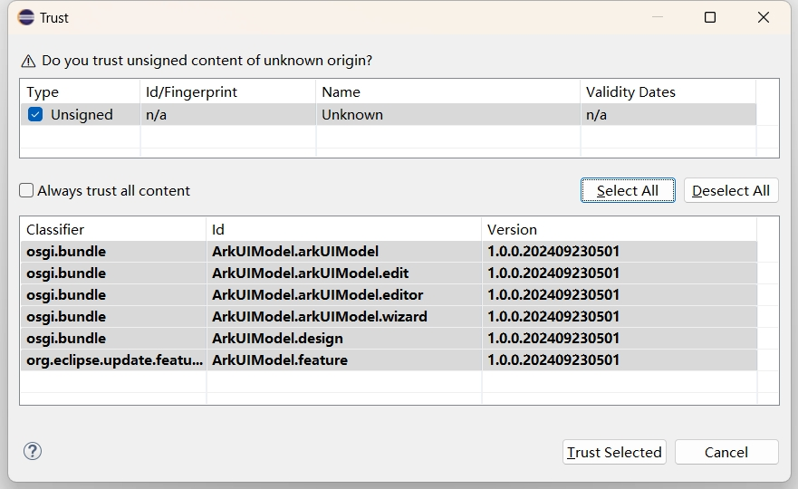

## 源码编译

开发者可以在根目录下执行 `mvn clean package` 以编译项目，随后可以在 `ArkDSL\ArkUIModel.updatesite\target` 路径下找到编译好的 `ArkUIModel.updatesite-X.X.X.zip` 插件包。

## 快速上手

1. 选择 Eclipse 顶部工具栏的 `File > New > Project...` 选项创建新项目；

2. 在弹出的窗口中选择 `Arkmodel > Arkmodel Project`，接着 `Next >`；

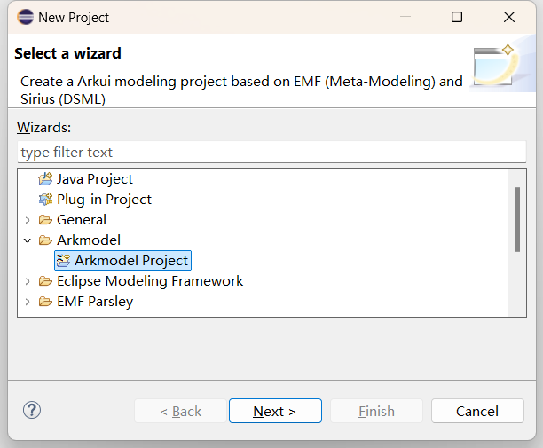

3. 配置新项目的名称和位置，接着 `Finish`；

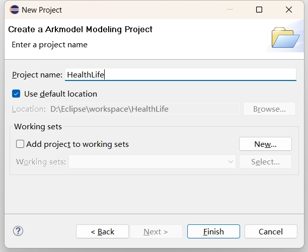

4. 双击默认创建的 aird 文件，可以在 UI Model Diagram 栏下找到默认创建的 GUIModel 项目结构视图；

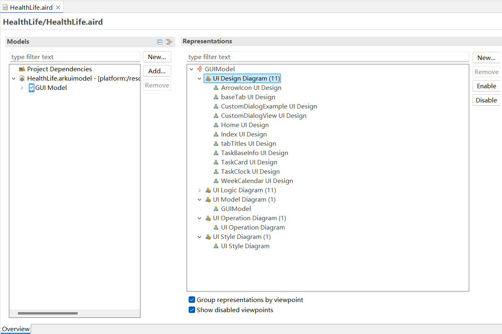

5. 双击 GUIModel 进入项目结构视图，可以通过从右侧 Elements 栏添加 Page 元素创建新页面。双击新创建的 Page 元素，弹出新建页面结构视图和逻辑结构视图的窗口，随后跳转到新建的页面和逻辑结构视图；

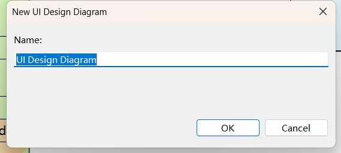

6. 此外还可以通过双击项目结构视图内的样式库和操作库元素新建项目样式视图和全局变量视图。

## 代码生成

利用 ArkDSL 模型生成鸿蒙应用代码的方法可以参考 [AutoArk](https://github.com/RM2PT/AutoArk) 插件安装。

## 开源许可

本项目使用 MIT 许可协议，详见 [LICENSE](./LICENSE) 文件。
